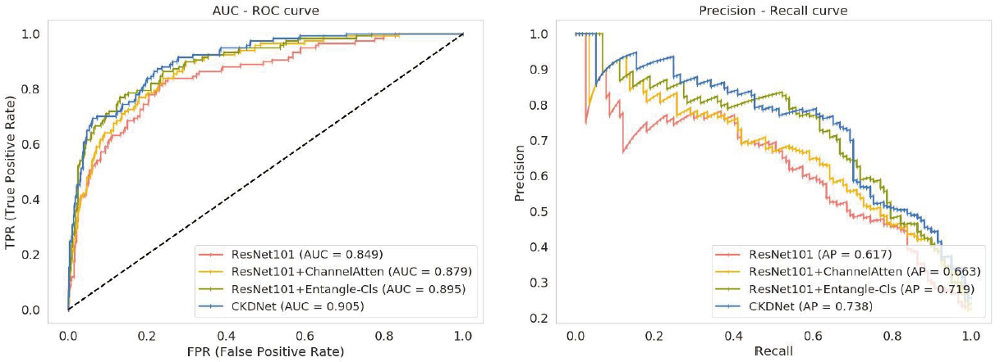
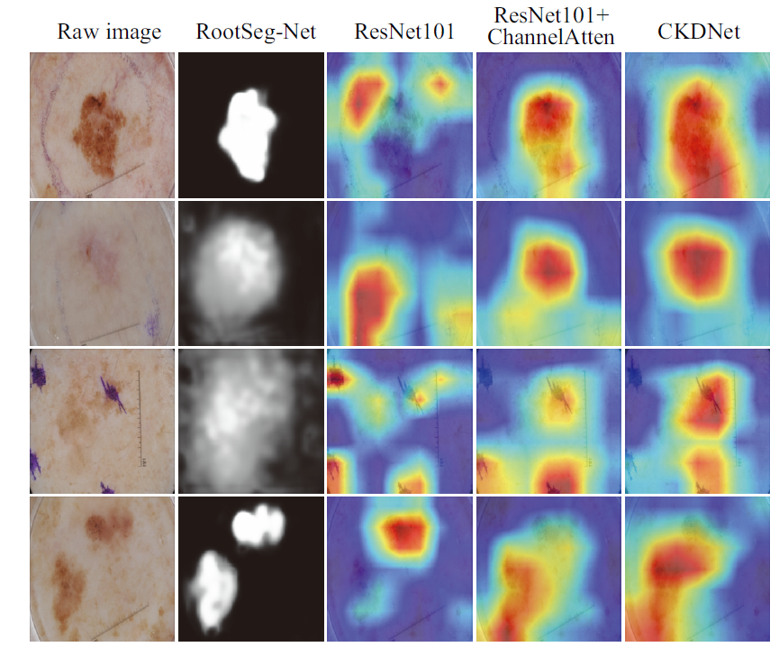
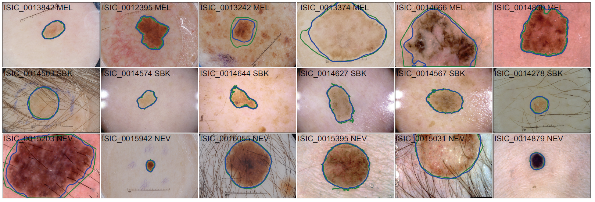

### Introduction

'[Cascade knowledge diffusion network for skin lesion diagnosis and segmentation]' published in Applied Soft Computing 

by [Qiangguo Jin](https://scholar.google.com/citations?user=USoKG48AAAAJ), [Hui Cui](https://scholars.latrobe.edu.au/display/lcui), [Changming Sun](https://vision-cdc.csiro.au/changming.sun/), [Zhaopeng Meng](http://cic.tju.edu.cn/info/1170/2451.htm), [Ran Su](http://www.escience.cn/people/suran/index.html). 

### Example results  


- AUC curve (a) and precision-recall curve (b) for effectiveness analysis of the Entangle-Cls module and the ChannelAtten block in
CKDNet.
- 

- Visualization and comparison of initial segmentation by RootSeg-Net and the CAMs obtained by three classification models.
- 

- Segmentation results with contours on the ISIC2017 test dataset. We choose six images from each lesion type, i.e., melanoma (MEL),
seborrheic keratosis (SBK), and nevus (NEV). Image name and lesion type are listed at the top of each image. Ground truth and our segmentation
results are shown by green and blue contours.

### Usage
 - [ ] Detailed usage instruction
  
### Training

### Testing

### Dataset
[ISIC2017](https://challenge.isic-archive.com/landing/2017),[ISIC2018](https://challenge.isic-archive.com/landing/2018)

## Citation

If the code is helpful for your research, please consider citing:

  ```shell
  @article{JIN2019,
    title = "Cascade knowledge diffusion network for skin lesion diagnosis and segmentation",
    year = "2020",
    author = "Qiangguo Jin, Hui Cui, Changming Sun, Zhaopeng Meng, Ran Su",
  }

  ```


### Questions

Please contact 'qgking@tju.edu.cn'
